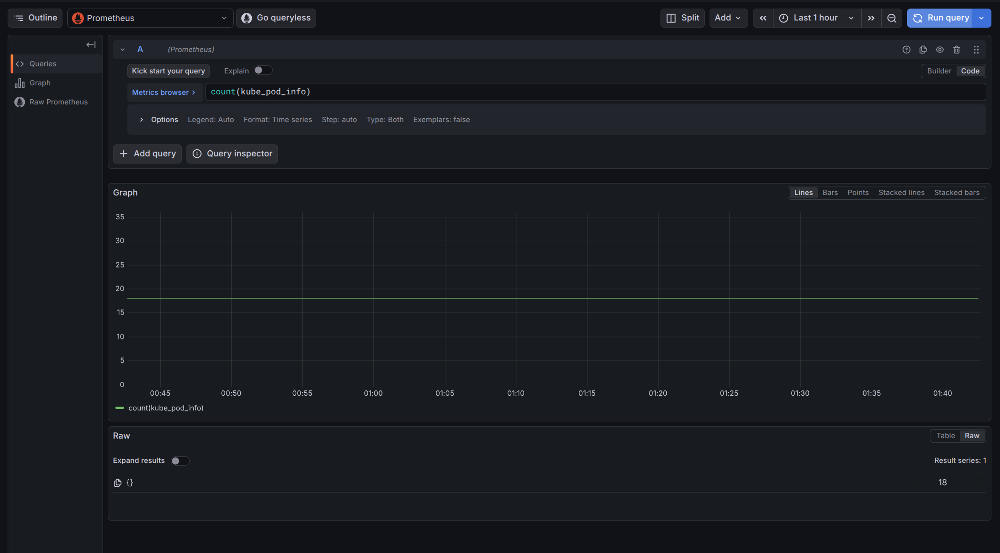
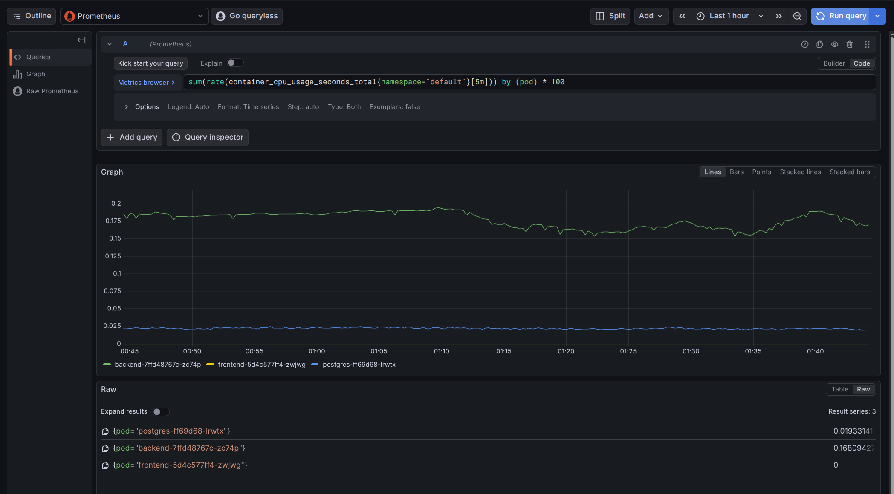
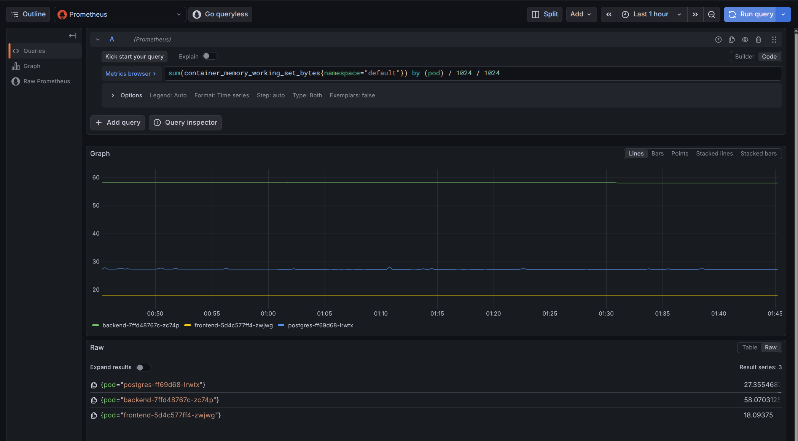
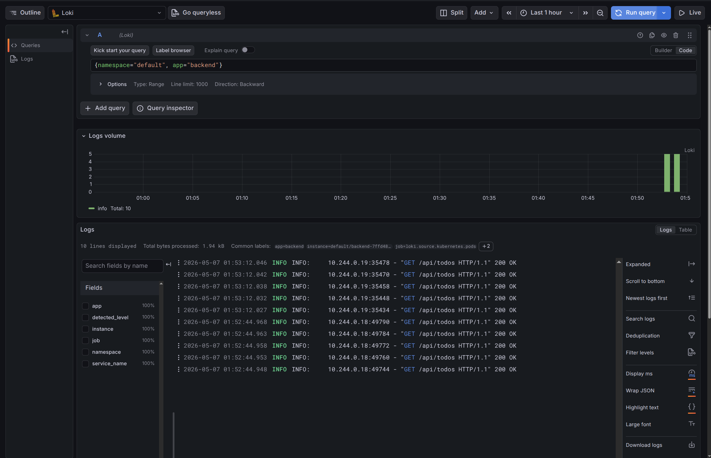

# Лабораторна робота №4 — Моніторинг хмарного застосунку

## Мета

Розгорнути стек моніторингу (Prometheus, Loki, Grafana Alloy, Grafana) у Kubernetes-кластері за допомогою Helm, відпрацювати запити PromQL/LogQL, провести навантажувальний тест та дослідити поведінку метрик під час відновлення pod-а.

---

## Завдання 1 — Розгортання стеку моніторингу

### 1.1 Простір імен і релізи Helm

```bash
kubectl create namespace monitoring
```

| Release     | Chart                        | App Version | Revision |
|-------------|------------------------------|-------------|----------|
| prometheus  | kube-prometheus-stack-84.5.0 | v0.90.1     | 1        |
| loki        | loki-7.0.0                   | 3.6.7       | 3        |
| alloy       | alloy-1.8.1                  | v1.16.1     | 1        |
| grafana     | grafana-10.5.15               | 12.3.1      | 1        |

Усі релізи розгорнуто в просторі імен `monitoring`.

### 1.2 Встановлення Prometheus (kube-prometheus-stack)

```bash
helm repo add prometheus-community https://prometheus-community.github.io/helm-charts
helm repo update
helm install prometheus prometheus-community/kube-prometheus-stack -n monitoring
```

Включає:
- Alertmanager
- kube-state-metrics
- node-exporter
- Prometheus Operator та Prometheus

### 1.3 Встановлення Loki (з персистентним сховищем)

```bash
helm repo add grafana https://grafana.github.io/helm-charts
helm install loki grafana/loki -n monitoring -f k8s/lab4/loki-values.yaml
```

Для Loki налаштовано персистентний PVC:

```yaml
# k8s/lab4/loki-values.yaml (ключові параметри)
loki:
  commonConfig:
    replication_factor: 1
  auth_enabled: false
  storage:
    type: filesystem
singleBinary:
  replicas: 1
  persistence:
    enabled: true
    size: 10Gi
```

**PVC:**

```
NAME             STATUS   VOLUME                                     CAPACITY   ACCESS MODES
storage-loki-0   Bound    pvc-0d818e13-6a90-40af-8964-91bf6ca25605   10Gi       RWO
```

### 1.4 Встановлення Grafana Alloy (збір логів)

```bash
helm install alloy grafana/alloy -n monitoring -f k8s/lab4/alloy-values.yaml
```

Alloy збирає логи з pod-ів кластера і відправляє до Loki.

### 1.5 Встановлення Grafana

```bash
helm install grafana grafana/grafana -n monitoring -f k8s/lab4/grafana-values.yaml
```

**PVC для Grafana:**

```
NAME      STATUS   CAPACITY
grafana   Bound    1Gi
```

### 1.6 Стан усіх pod-ів стеку моніторингу

```
alertmanager-prometheus-kube-prometheus-alertmanager-0   2/2   Running
alloy-bvflp                                              2/2   Running
grafana-56b6858759-qrzx2                                 1/1   Running
loki-0                                                   2/2   Running
prometheus-kube-prometheus-operator-5784db9788-kpxkv     1/1   Running
prometheus-kube-state-metrics-9549ddf4c-bnngj            1/1   Running
prometheus-prometheus-kube-prometheus-prometheus-0       2/2   Running
prometheus-prometheus-node-exporter-9zr9r                1/1   Running
```

### 1.7 Перевірка джерел даних у Grafana

Доступ до Grafana через port-forward:

```bash
kubectl port-forward service/grafana 3000:80 -n monitoring
# UI: http://localhost:3000  (admin / admin)
```

Перевірка джерел даних через Grafana HTTP API:

```bash
curl -sS -u admin:admin http://127.0.0.1:3000/api/datasources | python3 -m json.tool
```

Виявлено два джерела даних:
- **Prometheus** (id=1, type=prometheus) — `http://prometheus-kube-prometheus-prometheus:9090`
- **Loki** (id=2, type=loki) — `http://loki:3100`

### 1.8 Відповіді на питання до Завдання 1

1. **Чим відрізняються метрики від логів? Коли що використовувати?**
Метрики — це числові часові ряди (CPU, пам'ять, кількість pod-ів), вони підходять для графіків, алертів і швидкого виявлення аномалій. Логи — це текст подій (HTTP-запити, помилки, stack trace), вони потрібні для детального розслідування причин інциденту після того, як метрики показали проблему.

2. **Чому Loki індексує лише labels, а не повний текст логів? Які переваги і обмеження цього підходу?**
Індексація лише labels зменшує обсяг індексу і вартість зберігання, пришвидшує ingest і масштабування. Обмеження: запити по довільному тексту в тілі логу дорожчі та повільніші, ніж у системах з повнотекстовим індексом; тому важливо правильно проєктувати labels (`namespace`, `app`, `service_name`).

3. **Чому моніторинг розгорнуто в окремому namespace, а не разом із застосунком у default?**
Окремий namespace дає ізоляцію ресурсів і прав доступу, спрощує адміністрування, оновлення та видалення моніторингу без ризику зачепити застосунок, а також робить структуру кластера зрозумілішою.

---

## Завдання 2 — Запити та спостереження

### 2.1 Загальна кількість pod-ів у кластері (PromQL)

**Запит:**
```promql
count(kube_pod_info)
```

**Результат:**
```json
{"status":"success","data":{"resultType":"vector","result":[{"metric":{},"value":[...,"18"]}]}}
```

У кластері запущено **18 pod-ів** (застосунок + компоненти моніторингу + системні pod-и).

### 2.2 CPU-навантаження pod-ів у просторі імен `default`

**Запит:**
```promql
sum(rate(container_cpu_usage_seconds_total{namespace="default"}[5m])) by (pod) * 100
```

**Результат (% CPU):**

| Pod                          | CPU, % |
|------------------------------|--------|
| postgres-ff69d68-lrwtx        | 0.037  |
| backend-7ffd48767c-zc74p      | 0.290  |
| frontend-5d4c577ff4-zwjwg     | 0      |

### 2.3 Споживання пам'яті pod-ів у просторі імен `default`

**Запит:**
```promql
sum(container_memory_working_set_bytes{namespace="default"}) by (pod) / 1024 / 1024
```

**Результат (МіБ):**

| Pod                          | Пам'ять, МіБ |
|------------------------------|--------------|
| postgres-ff69d68-lrwtx        | 27.44        |
| backend-7ffd48767c-zc74p      | 58.66        |
| frontend-5d4c577ff4-zwjwg     | 18.02        |

### 2.4 Логи backend-а (LogQL)

**Запит:**
```logql
{namespace="default", app="backend"}
```

**POST-запит (ручне тестування):**
```
INFO:     10.244.0.1:PORT - "POST /api/todos HTTP/1.1" 201 Created
```

**GET-запити (під час навантажувального тесту):**
```
INFO:     10.244.0.17:43486 - "GET /api/todos HTTP/1.1" 200 OK
INFO:     10.244.0.17:43476 - "GET /api/todos HTTP/1.1" 200 OK
INFO:     10.244.0.17:43466 - "GET /api/todos HTTP/1.1" 200 OK
... (20 записів за останню хвилину)
```

Alloy збирає логи з pod-ів Kubernetes та передає їх до Loki з мітками `app`, `namespace`, `instance`.

### 2.5 Ручне тестування API застосунку

```bash
BACKEND_PORT=$(kubectl get svc backend -n default -o jsonpath='{.spec.ports[0].nodePort}')
BASE="http://$(minikube ip):$BACKEND_PORT"

# Health-check
curl -s $BASE/api/health               # {"status":"ok"}

# Створення завдання
curl -s -X POST $BASE/api/todos \
  -H "Content-Type: application/json" \
  -d '{"title":"Lab4 test","completed":false}'  # 201 Created

# Отримання списку
curl -s $BASE/api/todos                # [{"id":1,"title":"Lab4 test",...}]

# Видалення завдання
curl -s -X DELETE $BASE/api/todos/1   # 204 No Content
```

### 2.6 Навантажувальний тест і відновлення pod-а

#### Налаштування навантаження

```bash
kubectl run loadtest -n default --image=busybox --restart=Never -- \
  sh -c "while true; do wget -q -O- http://backend:8080/api/todos >/dev/null; done"
```

Pod `loadtest` безперервно виконував `GET /api/todos` протягом ~60 секунд.

#### Метрики під навантаженням

| Pod                          | CPU, % | Пам'ять, МіБ |
|------------------------------|--------|--------------|
| postgres-ff69d68-lrwtx        | 0.037  | 27.44        |
| backend-7ffd48767c-zc74p      | 0.290  | 58.66        |
| frontend-5d4c577ff4-zwjwg     | 0      | 18.02        |

#### Видалення та відновлення pod-а backend

```bash
OLD_POD=backend-7ffd48767c-zc74p
kubectl delete pod "$OLD_POD" -n default
# Очікування готовності нового pod-а...
NEW_POD=backend-7ffd48767c-zc74p
BACKEND_RECOVERY_SECONDS=1
```

**Спостереження:**
- Kubernetes автоматично перезапустив pod через ReplicaSet.
- Час відновлення: **1 секунда** (pod повернувся до стану `Ready`).
- Ім'я pod-а залишилося незмінним (`backend-7ffd48767c-zc74p`) — оскільки шаблон pod-а не змінювався, ReplicaSet повторно використав той самий шаблон.

#### Метрики CPU після відновлення

| Pod                          | CPU після відновлення, % |
|------------------------------|--------------------------|
| postgres-ff69d68-lrwtx        | 0.036                    |
| backend-7ffd48767c-zc74p      | 0.652                    |
| frontend-5d4c577ff4-zwjwg     | 0                        |

CPU backend-а після відновлення **зріс до ~0.65%** — pod відновився під активним навантаженням від `loadtest`.

### 2.7 Відповіді на питання до Завдання 2 (перед списком літератури)

1. **Чи видно момент падіння Pod на графіку CPU? Як саме – провал, стрибок, зникнення? Чи змінилось ім'я Pod?**
Так, момент падіння видно як коротке зникнення/провал серії backend pod-а на графіку CPU. Після відновлення з'являється активна серія знову. У цьому експерименті ім'я pod-а залишилося `backend-7ffd48767c-zc74p`.

2. **Скільки часу минуло від видалення Pod до появи метрик з нового Pod?**
За виміром у кластері: `BACKEND_RECOVERY_SECONDS=1`, тобто близько 1 секунди до стану `Ready` і появи метрик.

3. **Якби цього моніторингу не було (як у лабораторних 1–3), як би ви дізнались про падіння Pod?**
Довелось би діагностувати вручну: скарги користувача, ручні перевірки API, `kubectl get pods`, `kubectl describe`, `kubectl logs`. Це повільніше і реактивно. Моніторинг дає проактивне виявлення збоїв через графіки/логи й скорочує час пошуку причини.

---

## Структура файлів

- [k8s/lab4/loki-values.yaml](../../k8s/lab4/loki-values.yaml)
- [k8s/lab4/alloy-values.yaml](../../k8s/lab4/alloy-values.yaml)
- [k8s/lab4/grafana-values.yaml](../../k8s/lab4/grafana-values.yaml)

---

## Скріншоти

### Prometheus: кількість pod-ів



### Prometheus: CPU по pod-ах



### Prometheus: пам'ять по pod-ах



### Loki: логи backend


