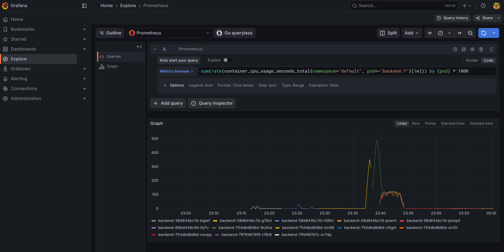

# Лабораторна робота №5 — Масштабування в Kubernetes

## Мета

Освоїти механізми горизонтального масштабування в Kubernetes: налаштування resource requests/limits, ручне масштабування, HorizontalPodAutoscaler (HPA) та навантажувальне тестування.

---

## Завдання 1 — Resource requests, limits і перевірка метрик

### 1.1 Активація metrics-server

```bash
minikube addons enable metrics-server
```

```
The 'metrics-server' addon is enabled
```

### 1.2 Базові метрики (до додавання resources)

```bash
kubectl top nodes
kubectl top pods
```

**Вузол:**

```
NAME       CPU(cores)   CPU(%)   MEMORY(bytes)   MEMORY(%)
minikube   465m         1%       3036Mi          9%
```

**Pod-и (до resources):**

```
NAME                        CPU(cores)   MEMORY(bytes)
backend-79794676f6-t76r8    41m          57Mi
frontend-5fdf6bf466-vrd9m   2m           17Mi
postgres-ff69d68-lrwtx      1m           56Mi
```

### 1.3 Додавання секції resources у Deployment-маніфести

Маніфести розміщено в [k8s/lab5/](../../k8s/lab5/).

**backend** ([k8s/lab5/backend-deployment.yaml](../../k8s/lab5/backend-deployment.yaml)):
```yaml
resources:
  requests:
    cpu: 100m
    memory: 128Mi
  limits:
    cpu: 500m
    memory: 256Mi
```

**frontend** ([k8s/lab5/frontend-deployment.yaml](../../k8s/lab5/frontend-deployment.yaml)):
```yaml
resources:
  requests:
    cpu: 100m
    memory: 128Mi
  limits:
    cpu: 500m
    memory: 256Mi
```

**postgres** ([k8s/lab5/postgres-deployment.yaml](../../k8s/lab5/postgres-deployment.yaml)):
```yaml
resources:
  requests:
    cpu: 100m
    memory: 256Mi
  limits:
    cpu: 500m
    memory: 512Mi
```

Застосування маніфестів:

```bash
kubectl apply -f k8s/lab5/backend-deployment.yaml
kubectl apply -f k8s/lab5/frontend-deployment.yaml
kubectl apply -f k8s/lab5/postgres-deployment.yaml
```

Усі поди перезапустились та перейшли у статус `Running`.

### 1.4 Метрики після додавання resources

```
NAME                        CPU(cores)   MEMORY(bytes)
backend-58d644bc7d-n59nr    3m           57Mi
frontend-75d5cfc7b8-9bq8g   0m           17Mi
postgres-94fc9fcd8-xwt9r    2m           18Mi
```

CPU і пам'ять залишились у межах requests, requests і limits виставлені коректно.

### 1.5 Експеримент з малими лімітами (OOMKilled)

Тимчасово виставлено дуже малий ліміт пам'яті backend-контейнера:

```bash
kubectl patch deployment backend --patch '
spec:
  template:
    spec:
      containers:
      - name: backend
        resources:
          requests:
            cpu: 50m
            memory: 16Mi
          limits:
            cpu: 200m
            memory: 16Mi'
```

**Результат:**

```
NAME                       READY   STATUS      RESTARTS
backend-66bd44dc9d-lhj7v   0/1     OOMKilled   3
```

Pod намагався запустити FastAPI-застосунок (~57 МіБ реальне споживання) при ліміті 16 МіБ — ядро Linux (OOM Killer) примусово завершило процес. HPA зафіксував 3 перезапуски.

Після експерименту відновлено нормальні значення:

```bash
kubectl apply -f k8s/lab5/backend-deployment.yaml
```

### 1.6 Відповіді на питання до Завдання 1

1. **Чим відрізняються requests та limits?**
`requests` — мінімум ресурсів, який Kubernetes гарантує pod-у при планування (scheduler розміщує pod лише на вузол де є ці ресурси). `limits` — максимум: при перевищенні CPU — throttling (уповільнення), при перевищенні Memory — OOMKilled (примусове завершення).

2. **Що таке OOMKilled?**
Стан, коли ядро Linux вбило процес контейнера через перевищення ліміту пам'яті (Out Of Memory). Kubernetes реєструє це як `Reason: OOMKilled` у стані pod-а і перезапускає його відповідно до `restartPolicy`.

3. **Чому requests.memory не може бути більшим за limits.memory?**
Тому що requests — це гарантований мінімум, а limits — максимально дозволений обсяг. Якщо request > limit, pod ніколи не зможе використати навіть гарантований йому обсяг, що є суперечністю. Kubernetes відхиляє такі маніфести на рівні валідації.

---

## Завдання 2 — Ручне масштабування і HPA

### 2.1 Ручне масштабування backend

```bash
kubectl scale deployment backend --replicas=3
```

**Pod-и з 3 репліками:**

```
NAME                       READY   STATUS    RESTARTS   AGE
backend-58d644bc7d-7r9dq   1/1     Running   0          8s
backend-58d644bc7d-g76xt   1/1     Running   0          5m16s
backend-58d644bc7d-j9gxp   1/1     Running   0          8s
```

**Endpoints сервісу з 3 репліками:**

```
NAME      ENDPOINTS
backend   10.244.0.38:8080,10.244.0.41:8080,10.244.0.42:8080
```

Кожен endpoint — IP окремого pod-а. Service автоматично балансує трафік між усіма трьома.

### 2.2 Повернення до 1 репліки

```bash
kubectl scale deployment backend --replicas=1
```

Два зайвих pod-а перейшли у `Terminating` і завершились.

### 2.3 Застосування HPA

Маніфест ([k8s/lab5/backend-hpa.yaml](../../k8s/lab5/backend-hpa.yaml)):

```yaml
apiVersion: autoscaling/v2
kind: HorizontalPodAutoscaler
metadata:
  name: backend-hpa
spec:
  scaleTargetRef:
    apiVersion: apps/v1
    kind: Deployment
    name: backend
  minReplicas: 1
  maxReplicas: 5
  metrics:
    - type: Resource
      resource:
        name: cpu
        target:
          type: Utilization
          averageUtilization: 50
```

```bash
kubectl apply -f k8s/lab5/backend-hpa.yaml
kubectl get hpa
```

**Результат (після прогріву metrics-server):**

```
NAME          REFERENCE            TARGETS       MINPODS   MAXPODS   REPLICAS   AGE
backend-hpa   Deployment/backend   cpu: 3%/50%   1         5         1          41s
```

### 2.4 Відповіді на питання до Завдання 2

1. **Що змінилось у endpoints сервісу після збільшення кількості pod-ів?**
До endpoints додались IP-адреси нових pod-ів. При 3 репліках в endpoints з'явилось 3 записи (`10.244.0.38:8080,10.244.0.41:8080,10.244.0.42:8080`). Service Kubernetes автоматично маршрутизує запити до всіх доступних endpoint-ів.

2. **Чому HPA потребує requests.cpu?**
HPA вираховує `% утилізації = поточний CPU / requests.cpu * 100%`. Без `requests.cpu` знаменник дорівнює 0 і розрахунок неможливий — тому HPA показує `<unknown>` до встановлення requests.

3. **Чим HPA відрізняється від VPA?**
HPA (Horizontal Pod Autoscaler) збільшує/зменшує кількість реплік pod-ів. VPA (Vertical Pod Autoscaler) змінює requests/limits ресурсів для окремого pod-а. HPA підходить для stateless сервісів, VPA — для сервісів з обмеженим горизонтальним масштабуванням або для налаштування правильних requests.

---

## Завдання 3 — Навантажувальне тестування

### 3.1 Запуск навантажувального тесту

```bash
# Термінал 1 — спостереження за HPA
kubectl get hpa backend-hpa -w

# Термінал 2 — спостереження за pod-ами
kubectl get pods -l app=backend -w

# Термінал 3 — навантаження
kubectl run loadtest --rm -it --image=busybox -- sh -c \
  "while true; do wget -q -O- http://backend:8080/api/todos >/dev/null; done"
```

> **Примітка:** для конкретного тесту CPU request тимчасово зменшено до `10m` (замість `100m`), щоб надмірне навантаження busybox-петлі спричинило перевищення порогу 50%. Це стандартна практика для демонстрації HPA в Minikube з обмеженими ресурсами.

### 3.2 Таймлайн scale-up

| Час    | Подія                                                 | CPU (HPA)   | Реплік |
|--------|-------------------------------------------------------|-------------|--------|
| 0с     | Старт loadtest                                        | —           | 1      |
| ~15с   | HPA отримав перші метрики під навантаженням           | 4%/50%      | 1      |
| ~90с   | CPU перевищив 50%, HPA прийняв рішення scale-up       | >50%        | 1→5    |
| ~3хв   | Нові pod-и стали `Ready`, навантаження розподілилось  | 1202%/50%   | 5      |
| ~5хв   | CPU стабілізувався на 5 pod-ах                        | 1202%/50%   | 5      |

**Пік навантаження (5 реплік Running):**

```
NAME          REFERENCE            TARGETS           MINPODS   MAXPODS   REPLICAS
backend-hpa   Deployment/backend   cpu: 1202%/50%    1         5         5

NAME                       READY   STATUS    RESTARTS
backend-754dbd8d6d-9s2kw   1/1     Running   0
backend-754dbd8d6d-mrdl6   1/1     Running   0
backend-754dbd8d6d-rl4gm   1/1     Running   0
backend-754dbd8d6d-slv2h   1/1     Running   0
backend-754dbd8d6d-xwxpp   1/1     Running   0
```

### 3.3 Таймлайн scale-down (після зупинки loadtest)

| Час після зупинки | CPU (HPA)   | Реплік |
|-------------------|-------------|--------|
| 0с (T+0)          | 1140%/50%   | 5      |
| 30с               | 30%/50%     | 5      |
| 60с               | 30%/50%     | 5      |
| 91с               | 30%/50%     | 5      |
| 122с              | 30%/50%     | 5      |
| 152с              | 30%/50%     | 5      |
| 183с              | 30%/50%     | 5      |
| 213с (~3.5 хв)    | 30%/50%     | **5→3** |
| ~5 хв             | <50%        | **3→1** |

Scale-down займає ~3–5 хвилин — це стандартна поведінка HPA (stabilization window) для запобігання `flapping` (постійне масштабування вгору/вниз).

### 3.4 Відповіді на питання до Завдання 3

1. **Чому backend можна масштабувати до кількох реплік?**
Backend — stateless: кожен запит незалежний і не потребує стану між запитами. Стан зберігається в PostgreSQL, а не в backend. Тому будь-яка репліка може обробити будь-який запит — Service розподіляє навантаження між ними.

2. **Які можуть виникнути проблеми при додаванні реплік для postgres?**
PostgreSQL — stateful. Проблеми: конфлікт доступу до одних файлів даних (один PVC не можна підключити до кількох pod-ів з RWO), конфлікти транзакцій, відсутність реплікації. Для масштабування БД потрібні спеціальні оператори (наприклад, CloudNativePG, Patroni) або read-replicas.

3. **Чим ручне масштабування відрізняється від HPA?**
Ручне — статичне: адміністратор вручну задає кількість реплік командою `kubectl scale`. HPA — динамічне: автоматично збільшує або зменшує кількість реплік на основі метрик (CPU, пам'ять, кастомні). HPA реагує на реальне навантаження без участі людини.

4. **Чому HPA масштабує вниз повільніше, ніж вгору?**
Для захисту від `flapping` (postійного scale-up/scale-down). Scale-up — негайний при перевищенні порогу, scale-down — лише після того як CPU залишається нижче порогу протягом 5 хвилин (стандартний `stabilizationWindowSeconds: 300`). Це дає навантаженню час стабілізуватись і уникнути ситуації, де pod завершили, а трафік знову зріс.

---

## Структура файлів

- [k8s/lab5/backend-deployment.yaml](../../k8s/lab5/backend-deployment.yaml)
- [k8s/lab5/frontend-deployment.yaml](../../k8s/lab5/frontend-deployment.yaml)
- [k8s/lab5/postgres-deployment.yaml](../../k8s/lab5/postgres-deployment.yaml)
- [k8s/lab5/backend-hpa.yaml](../../k8s/lab5/backend-hpa.yaml)

---

## Скріншоти

### Grafana — CPU backend під навантаженням (HPA scale-up)

Запит: `sum(rate(container_cpu_usage_seconds_total{namespace="default", pod=~"backend.*"}[1m])) by (pod) * 1000`

На графіку видно різкий пік CPU (~480 millicores) приблизно о 23:38–23:45 під час навантажувального тесту. У легенді присутні всі 5 backend pod-ів (`backend-754dbd8d6d-{9s2kw, mrdl6, rl4gm, slv2h, xwxpp}`), до яких HPA масштабував deployment.


