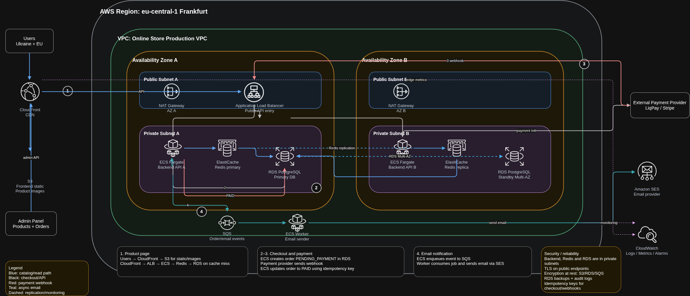

# Лабораторна робота 6. Проєктування архітектури онлайн-магазину в AWS

## Мета

Спроєктувати cloud-архітектуру онлайн-магазину в AWS відповідно до заданих функціональних і нефункціональних вимог.

## Завдання 1. Архітектурна діаграма

Регіон: eu-central-1 (Frankfurt).

Діаграма:

Діаграма повністю відображає такі обов'язкові елементи:

1. AWS Region: eu-central-1.
2. VPC для production-середовища.
3. Дві Availability Zones: Zone A і Zone B.
4. Public subnets у кожній AZ (з ALB/NAT).
5. Private subnets у кожній AZ (backend, cache, database).
6. CloudFront для клієнтського доступу.
7. S3 для статики та зображень товарів.
8. ALB як публічна точка входу в API.
9. Compute layer: ECS Fargate (Backend API A/B) + окремий ECS Worker.
10. База даних: RDS PostgreSQL Multi-AZ (Primary + Standby).
11. Кеш: ElastiCache Redis (primary + replica).
12. Асинхронна обробка: SQS для order/email events.
13. Моніторинг: CloudWatch Logs/Metrics/Alarms.
14. Зовнішні системи: Stripe/LiqPay і Amazon SES.
15. Зовнішні клієнти: Users (Ukraine + EU) та Admin Panel (Products + Orders).

### Основні потоки на діаграмі

1. Перегляд сторінки товару:
Users -> CloudFront -> S3 (статика/зображення) або CloudFront -> ALB -> ECS -> Redis -> RDS.

2. Оформлення замовлення:
CloudFront -> ALB -> ECS Backend -> RDS (створення order зі статусом PENDING_PAYMENT) -> ініціація платежу в Stripe/LiqPay.

3. Підтвердження оплати:
Stripe/LiqPay -> webhook -> ALB -> ECS Backend -> оновлення order в RDS до PAID (ідемпотентно).

4. Email-повідомлення:
ECS Backend -> SQS -> ECS Worker -> Amazon SES -> email користувачу.

## Завдання 2. Обґрунтування ключових рішень

### Рішення 1. Регіон eu-central-1

Рішення: використано один регіон AWS eu-central-1.

Чому: основна географія користувачів — Україна та сусідні країни ЄС; це зменшує latency і спрощує операційну модель.

Альтернатива: eu-west-1 або multi-region.

Trade-off: один регіон дешевший і простіший, але не захищає від повного regional outage.

### Рішення 2. CloudFront + S3 для read-heavy частини

Рішення: статичний фронтенд і зображення товарів віддаються через CloudFront із S3.

Чому: каталог і зображення формують основне read-навантаження; CDN знижує p95 latency і навантаження на backend.

Альтернатива: віддача статики через backend/ALB.

Trade-off: потрібне керування кеш-інвалідацією, але значно краща продуктивність і нижча вартість трафіку.

### Рішення 3. ECS Fargate як compute layer

Рішення: API і worker виконуються в ECS Fargate.

Чому: не потрібне адміністрування EC2, горизонтальне масштабування під піки реалізується стандартно.

Альтернатива: EC2 ASG або Lambda.

Trade-off: вища ціна порівняно з EC2 при стабільному навантаженні, але менший операційний overhead.

### Рішення 4. RDS PostgreSQL Multi-AZ для транзакційних даних

Рішення: замовлення, користувачі та товари зберігаються в RDS PostgreSQL Multi-AZ.

Чому: checkout вимагає ACID-транзакцій і гарантії збереження підтверджених замовлень.

Альтернатива: single-AZ RDS або NoSQL-підхід.

Trade-off: Multi-AZ дорожчий, але забезпечує failover і вищу надійність для критичних даних.

### Рішення 5. Redis для гарячих read-даних

Рішення: ElastiCache Redis primary/replica використовується для кешування каталогу.

Чому: повторювані read-запити до каталогу та карточок товарів краще обробляти в кеші, а не в RDS.

Альтернатива: кешувати тільки на рівні CloudFront або читати напряму з RDS.

Trade-off: необхідно контролювати інвалідацію кешу, зате суттєво знижується навантаження на DB.

### Рішення 6. SQS + ECS Worker для асинхронних email-процесів

Рішення: після зміни статусу замовлення backend публікує подію в SQS, worker надсилає email через SES.

Чому: email не блокує checkout/webhook, система стійка до тимчасових помилок зовнішніх сервісів.

Альтернатива: синхронна відправка email в API-потоці.

Trade-off: додається окремий worker і черга, але зменшується ризик втрати подій і зростає стабільність.

## Завдання 3. Поведінка при збоях

### 3.1 Впав один backend instance

Що бачить користувач: частина запитів може отримати короткочасну помилку, далі трафік переходить на здоровий instance.

Чи продовжує система працювати: так, ALB і health checks виключають проблемний target, ECS піднімає заміну.

Роль ALB/health checks/auto scaling: ALB виконує перевірки доступності, ECS відновлює кількість tasks, autoscaling підтримує потрібну ємність.

Чи втрачаються дані: ні, дані зберігаються в RDS/Redis, а не в локальному стані контейнера.

### 3.2 Впав primary RDS instance

Що відбувається з checkout: під час failover можливі тимчасові помилки запису в БД.

Чи буде коротка недоступність: так, короткий інтервал до автоматичного перемикання на standby.

Як працює failover: RDS Multi-AZ переводить роль primary на standby в іншій AZ.

Чи можуть загубитися підтверджені замовлення: підтверджені транзакції не втрачаються за рахунок реплікації й транзакційної моделі.

Механізми захисту: транзакції, retry з backoff, idempotency keys для checkout/webhook, резервні копії.

### 3.3 Платіжний провайдер недоступний 10 хвилин

Що бачить користувач: повідомлення про тимчасову недоступність оплати.

Чи створюється замовлення: створюється order у статусі PENDING_PAYMENT.

Який статус замовлення: PENDING_PAYMENT до отримання webhook або PAYMENT_FAILED за політикою timeout.

Чи потрібні retry: так, обробка webhook та повторні перевірки статусу платежу виконуються ідемпотентно.

Як уникнути дублювань: унікальні idempotency keys для платежу і webhook-обробки, перевірка дубльованих подій перед оновленням order.

Роль webhook: основний механізм фінального підтвердження оплати і переходу замовлення в PAID.

## Структура файлів

- [docs/lab6/aws_store.drawio](aws_store.drawio) — вихідний файл діаграми.
- [docs/lab6/aws_store.drawio.png](aws_store.drawio.png) — діаграма для звіту.
- [docs/lab6/LAB6_REPORT.md](LAB6_REPORT.md) — фінальний звіт.
